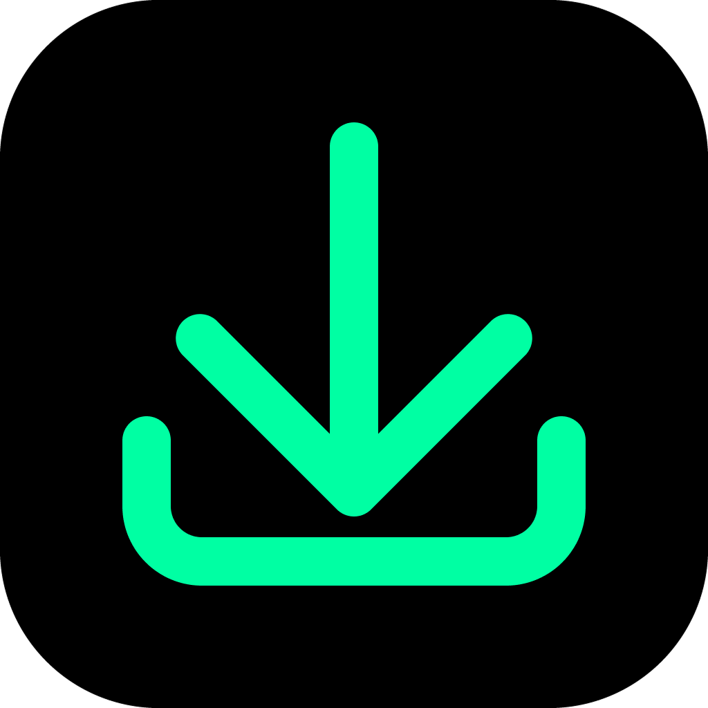

[](README.md)
[](README-en.md)
[](https://github.com/honey720/chzzk-vod-downloader-v2/releases)


<p align="center">
  
</p>

# 치지직 VOD 다운로더 v2

> 치지직 다시보기와 클립을 다운로드하는 프로그램입니다.


---

## ✨ 특징

- 인터넷 회선이 낼 수 있는 최대 속도로 내려받습니다.
- 여러 영상을 목록에 담아 한 번에 받을 수 있습니다.
- 원하는 화질을 골라서 받을 수 있습니다.
- 쿠키를 등록하면 연령 제한 영상과 멤버십 전용 영상도 받을 수 있습니다.

---

## 💾 다운로드

최신 버전은 [Releases](https://github.com/honey720/chzzk-vod-downloader-v2/releases) 페이지에 있습니다. 아래 표에서 내 OS에 맞는 파일을 받으세요. (`<버전>` 자리에는 릴리즈 태그가 들어갑니다. 예: `v2.9.0`)

| OS | 지원 범위 | 받을 파일 |
|---|---|---|
| Windows | Windows 10 / 11 (x64) | `CVDv2-<버전>-windows.exe` |
| macOS | **Apple Silicon(M1 이상) 전용 — 인텔 맥은 지원하지 않습니다** | `CVDv2-<버전>-macos-arm64.zip` |
| Linux | Ubuntu 22.04 이상 상당 (x64) | `CVDv2-<버전>-linux` |

> 여기에 해당하지 않는 환경이라면 소스에서 직접 실행할 수도 있습니다 — 아래 **개발자 안내**를 펼쳐 보세요.

---

## 🚀 사용법

1. **영상 추가**
   - 다시보기나 클립 URL을 붙여넣고 **VOD 추가** 버튼을 누르거나 엔터를 치면 목록에 추가됩니다.
   - 치지직 페이지의 영상 카드를 끌어다 놓아도 되고, 메모장에 모아 둔 URL 목록을 통째로 끌어와도 됩니다.

2. **화질 선택**
   - 추가된 카드에서 원하는 화질 버튼을 누르세요. 따로 고르지 않으면 가장 높은 화질로 받습니다.

3. **다운로드**
   - **다운로드/정지** 버튼으로 시작하거나 잠시 멈출 수 있고, **중지** 버튼으로 취소합니다.

4. **설정 · 쿠키 등록**
   - 연령 제한 영상과 멤버십 전용 영상은 해당 계정의 쿠키를 등록해야 받을 수 있습니다. **설정**에서 쿠키를 등록하세요.
   - 언어를 바꿨다면 적용 후 프로그램을 재시작해야 합니다.


---

<details>
<summary><b>📖 유저 안내 — macOS 첫 실행 · 백신 오탐 · 주의사항</b></summary>

#### 🍎 macOS에서 처음 실행할 때

앱에 코드 서명이 없어서 처음 열면 "확인되지 않은 개발자" 경고와 함께 실행이 막힙니다. 처음 한 번만 아래처럼 허용하면 그다음부터는 평소대로 실행됩니다.

1. `CVDv2.app`을 실행하고, 경고 창이 뜨면 닫습니다.
2. **시스템 설정 → 개인정보 보호 및 보안**에서 CVDv2 항목 옆의 **확인 없이 열기**를 누릅니다.

터미널이 편하다면 격리 속성을 지우는 방법도 있습니다:

```bash
xattr -dr com.apple.quarantine /Applications/CVDv2.app
```

#### 🛡 백신이 악성 파일로 잡을 때

Nuitka로 컴파일한 실행 파일은 코드 서명과 평판 정보가 없어서, 일부 백신(특히 Windows Defender)이 악성으로 잘못 판정하는 일이 흔합니다. 컴파일 방식 때문에 생기는 오탐이며 실제 악성 코드가 아닙니다.

- 릴리즈마다 **VirusTotal 전체 엔진 검사 링크**를 릴리즈 노트에 첨부하니 직접 확인할 수 있습니다.
- 실행 파일은 **BitDefender Labs에서 안전(무해) 판정**을 받았습니다.

#### ⚠ 주의사항

- 아직 안정 버전이 아닙니다.
- 프로그램 사용 중 생길 수 있는 피해는 개발자가 책임지지 않습니다.

</details>

<details>
<summary><b>🛠 개발자 안내 — 소스에서 실행 · 개발용 스크립트 · 라이선스</b></summary>

#### 소스에서 실행

의존성은 [uv](https://docs.astral.sh/uv/)로 관리하며, Python 3.13 이상이 필요합니다.

```bash
uv sync                  # 의존성 설치
uv run python main.py    # 앱 실행
```

#### 개발용 스크립트

- 다운로드 문제를 제보할 때는 `uv run python scripts/capture_playback_debug.py <VOD URL>` 로 응답을 캡처해 함께 첨부해 주세요. 쿠키와 토큰은 자동으로 지워집니다.
- GUI 없이 받으려면: `uv run python scripts/headless_download.py <VOD/클립 URL> [--resolution N] [--output PATH] [--timeout SEC]`

#### 라이선스

- 이 프로그램은 [GPL-3.0](LICENSE) 라이선스로 배포됩니다.
- 배포본에는 병합 산출물의 재포장(remux)에 쓰는 [FFmpeg](https://ffmpeg.org) 실행 파일이 들어 있습니다
  — pip 패키지 [imageio-ffmpeg](https://github.com/imageio/imageio-ffmpeg)(BSD-2-Clause)가 동봉하는 GPL 빌드 바이너리입니다.
  FFmpeg는 FFmpeg 프로젝트의 저작물이며, 소스 코드는 [FFmpeg 공식 저장소](https://github.com/FFmpeg/FFmpeg)와
  각 빌드 제공처에서 구할 수 있습니다.

</details>

---

## 💡 문의

버그를 발견했거나 제안이 있다면 [Issues](https://github.com/honey720/chzzk-vod-downloader-v2/issues)에 남겨 주세요.
